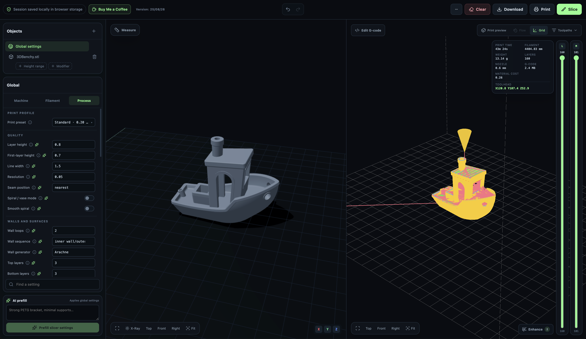
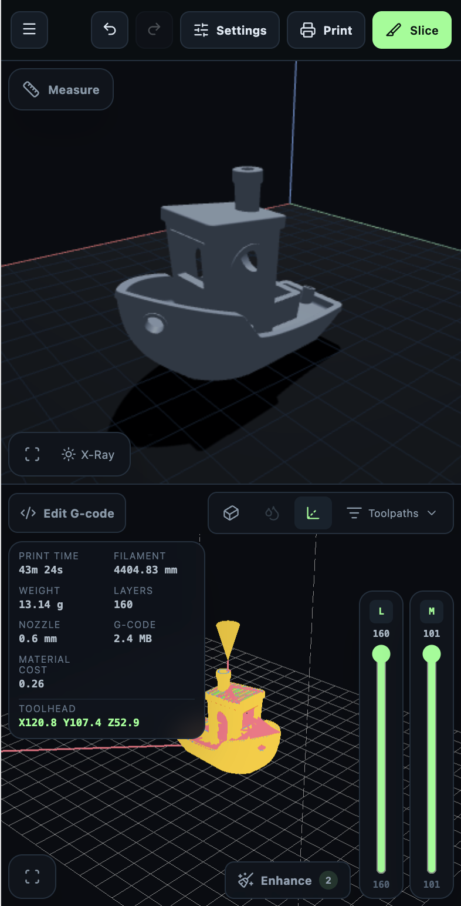

# SliceMe

[](LICENSE)
[](CONTRIBUTING.md)

SliceMe is an **open-source, community-driven** browser workspace for preparing
3D models, configuring a slicer, generating G-code, and reviewing print paths.
You are welcome to use it, self-host it, fork it, improve it, report problems,
and submit pull requests.

The project uses the strong-copyleft [GNU Affero General Public License v3.0 or
later](LICENSE). Forks and commercial services are permitted by that license,
but modified versions distributed or offered to users over a network must make
their corresponding source available under the same license. The license does
not grant rights to the SliceMe name or branding; see [TRADEMARKS.md](TRADEMARKS.md).

Models, settings, UI preferences, and generated G-code are stored locally in
the browser. Slicing inputs exist on the API only for the lifetime of one
request.

## Screenshots

| Desktop | Mobile |
| --- | --- |
|  |  |

The desktop workspace shows model objects, the slicer settings panel with AI
settings prefill, and the G-code preview with print statistics. The mobile
workspace adapts the same tools into a touch-first layout with the same
slice, print, and settings actions.

## Get involved

- Read [CONTRIBUTING.md](CONTRIBUTING.md) to set up a fork and submit a pull request.
- Use [GitHub Issues](https://github.com/itymarcel/sliceme/issues) for reproducible bugs and focused feature proposals.
- Open pull requests against `dev`; reviewed changes are promoted to `master`.

## Architecture

- `apps/web`: dark React/Vite workspace. It persists uploaded model files,
  generated G-code, slicer settings, transforms, selection, and UI preferences
  in IndexedDB so the current workspace survives refreshes and browser restarts.
- `services/slicer`: stateless FastAPI service and OrcaSlicer runtime. It builds an Orca-native 3MF from the request, runs Orca, streams back G-code, and removes its temporary directory.
- `compose.yaml`: local development stack with Nginx proxying `/api` to the slicer.

There is no Django, GraphQL, authentication, server-side database, Redis,
Celery, product model, or object storage dependency.

## Credits

- Perimeter Echo by Sam Beany.
- G-code preview geometry adapted from [aligator/gcode-viewer](https://github.com/aligator/gcode-viewer); see [THIRD_PARTY_NOTICES.md](THIRD_PARTY_NOTICES.md).

## Browser-local workspace

The frontend maintains one current workspace per browser profile and site
origin. IndexedDB is used instead of `localStorage` because model and G-code
files can be large binary objects. The app also asks the browser for durable
storage when that API is available.

The workspace remains on that device after the browser closes. **Clear** removes
the saved models, generated G-code, settings, transforms, and UI preferences.
Browser site-data controls and private-browsing rules can also remove it, and a
browser may still evict storage under exceptional space pressure. Nothing is
synced between devices or uploaded anywhere except to the stateless slicer API
during a slice or enhancement request.

## Printer and print profiles

The Target printer control is populated from the instantiated machine profiles
bundled with the active OrcaSlicer runtime. SliceMe resolves profile inheritance
and applies the complete machine configuration, including printable dimensions,
nozzle data, firmware options, machine limits, speeds, and start/end G-code.
The runtime profile bundle therefore determines the available manufacturers and
machines.

Print presets are independent from printer profiles. Draft, Standard, Fine,
Strong, and Vase replace the complete current process configuration; the UI
labels this overwrite behavior before selection. Individual process settings
remain editable after applying a preset.

## OrcaSlicer 3MF projects

**Import `*.3mf`** replaces the current browser workspace only after the API has
validated and parsed the complete project. The supported Orca/standard 3MF
subset is:

- mesh objects, component references, build items, object names, affine build
  transforms, and standard 3MF length units;
- printable component parts and recognized spatial modifier parts, with their
  component/build transforms baked into temporary STLs and XY positions preserved;
- global printer, process, and filament keys that exist in SliceMe's current
  profiles;
- recognized per-object process/material settings and modifier-part settings.

Unsafe or unsupported global settings are counted and reported. Import never
applies custom G-code. Painted seams/supports, variable layer height, plate
thumbnails, and additional plate layouts are not currently imported. The API
treats 3MF as an untrusted ZIP/XML package: archive
paths, entry count, expanded archive size, model XML size, component depth,
component instances (10,000), imported model count (12), expanded geometry
(500,000 vertices and triangles), generated model bytes (50 MiB), transforms,
triangle indices, and numeric coordinates are validated before the browser
workspace changes.

**Export 3MF** downloads the current SliceMe models, transforms, global settings,
per-object overrides, height ranges, and supported per-layer events as the same
native Orca project package used by the slicing backend. The exported project is
intended for OrcaSlicer and can also be imported back into SliceMe within the
subset above.

## Provide the Orca runtime image

The slicer service is built on the public custom Orca runtime published by [`itymarcel/custom-orca`](https://github.com/itymarcel/custom-orca). The runtime contains an executable at `/opt/orcaslicer/AppRun`.

On this `dev` branch, local Docker Compose builds default to the moving ARM64
development image for Apple Silicon and Raspberry Pi:

```text
ghcr.io/itymarcel/custom-orca:dev-arm64
```

Override `ORCA_RUNTIME_IMAGE` with an immutable tag when selecting a release or
another architecture:

```bash
ORCA_RUNTIME_IMAGE=ghcr.io/itymarcel/custom-orca:sha-fd98397-arm64 docker compose build --pull slicer-api
```

AMD64 consumers, including Railway, use the corresponding tag without the `-arm64` suffix:

```text
ghcr.io/itymarcel/custom-orca:sha-fd98397
```

Publishing a new custom Orca image does not rebuild this project automatically. Update the pinned tag and rebuild the slicer service when adopting a new custom Orca commit.

## Run with Docker

For development on ARM64 (including the Raspberry Pi), the ordinary Compose
commands consume the mutable `dev-arm64` runtime produced from the
`custom-orca/dev` branch:

```bash
docker compose build --pull
docker compose up
```

For frontend development with automatic browser refresh, use the development
override:

```bash
docker compose -f compose.yaml -f compose.dev.yaml up --build
```

The override runs Vite inside Docker, mounts `apps/web`, and enables hot module
replacement. Changes to CSS, TypeScript, and React components appear without
rebuilding or restarting Docker. Rebuild the `web` service only after changing
`package.json` or `package-lock.json`. The ordinary `docker compose up` command
continues to use the production Nginx build and remains suitable for Pi testing.

Frontend/API-only changes reuse the existing runtime image. Changes to the Orca
engine must first be pushed to `custom-orca/dev`; wait for its runtime workflow
to publish `dev-arm64`, then rebuild the slicer API with `--pull`.

To deliberately test the current main runtime from this branch, override it:

```bash
ORCA_RUNTIME_IMAGE=ghcr.io/itymarcel/custom-orca:main-arm64 docker compose build --pull slicer-api
```

Open <http://localhost:3007>.

From another device on the same local network, open the Pi's LAN address on
port 3007 (`http://<pi-lan-ip>:3007`). macOS may also resolve the
mDNS hostname as `http://<device-hostname>.local:3007`. The Compose port is bound on all
interfaces; this is an unencrypted development endpoint, so expose it only on
a trusted LAN.

## Frontend development

The Docker development override above is the easiest option. Alternatively,
run the API container on port 8080, then run Vite directly on the host:

```bash
cd apps/web
npm install
npm run dev
```

Vite proxies `/api` to `http://localhost:8080`.

## AI settings prefill

The AI prefill control sends the print description and a limited set of current
printer/material values to the slicer API. The API calls OpenAI's Responses API
with a strict JSON schema, post-processes nozzle and spiral-mode relationships,
and returns OrcaSlicer settings. The browser never receives the OpenAI key.

Set the key only for `slicer-api`, normally in the ignored root `.env` file or
in the deployment platform's server-side variables:

```text
OPENAI_API_KEY=...
OPENAI_SLICER_MODEL=gpt-5.4
OPENAI_PREFILL_RATE_LIMIT=10
OPENAI_PREFILL_RATE_WINDOW_SECONDS=600
```

Do not use a `VITE_` or `REACT_APP_` prefix for the key. Those prefixes are for
values that frontend build systems may expose to browser code. The prefill
endpoint is disabled with a clear error when `OPENAI_API_KEY` is absent. By
default, each client can make 10 prefill requests per 10-minute window; set the
rate limit to `0` only when another trusted gateway enforces usage limits.

## API

`POST /api/slice` accepts multipart form data:

- `manifest`: JSON containing model IDs, config buckets, overrides, ranges, transforms, and custom G-code events.
- `models`: one or more STL, STEP, or STP files in the same order as `manifest.models`.

It responds directly with a `.gcode` attachment. Inputs and output are never placed in durable storage.

`POST /api/import-project` accepts one Orca/standard `.3mf` and responds with a
transient ZIP containing a JSON manifest plus extracted binary STL objects.
`POST /api/export-project` accepts the same manifest/models as `/api/slice` and
responds with a native Orca `.3mf` attachment. Neither endpoint stores projects.

## Checks

```bash
cd apps/web && npm run build
cd services/slicer
python3 -m venv .venv
.venv/bin/python -m pip install -r requirements.txt
.venv/bin/python -m unittest discover -s tests
```

An end-to-end slice requires the Orca runtime container. The engine unit tests mock only the final Orca process invocation; 3MF creation remains real.

## License

SliceMe is licensed under the [GNU Affero General Public License, version 3 or
later](LICENSE). Copyright © 2026 itymarcel and SliceMe contributors.

The AGPL is an open-source license and therefore allows commercial use,
including paid distribution. Its protection is copyleft: redistributors and
operators of modified network versions must preserve the license and provide
the corresponding source. A distributed or network-served modified fork cannot
remain closed source.

No trademark rights are granted under the software license. See
[TRADEMARKS.md](TRADEMARKS.md). Third-party components retain their own terms;
see [THIRD_PARTY_NOTICES.md](THIRD_PARTY_NOTICES.md).
